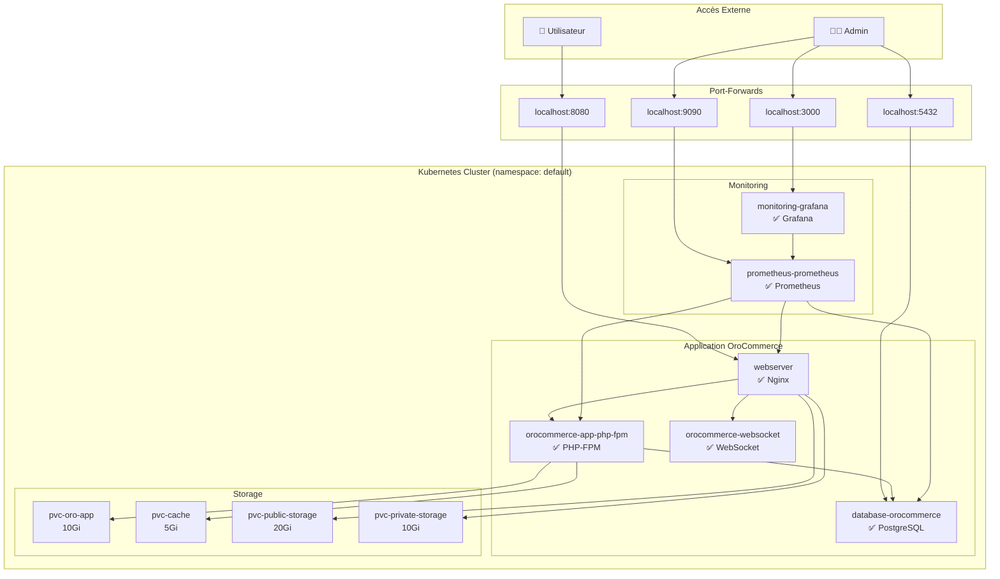

# 🚀 OroCommerce Kubernetes - Guide Complet

**Projet EII 5 - Migration OroCommerce vers Kubernetes**  
**Bloc RNCP** : EII 5 - Clusterisation de conteneurs

## 📋 Table des matières

- [🎯 Vue d'ensemble](#-vue-densemble)
- [✅ Prérequis](#-prérequis)
- [⚙️ Installation rapide](#️-installation-rapide)
- [🚀 Accès aux interfaces](#-accès-aux-interfaces)
- [🔧 Configuration avancée](#-configuration-avancée)
- [📊 Monitoring](#-monitoring)
- [🛠️ Dépannage](#️-dépannage)
- [📚 Documentation complète](#-documentation-complète)

## 🎯 Vue d'ensemble

Ce projet migre l'application **OroCommerce Demo** depuis Docker Compose vers Kubernetes en utilisant Helm Charts. L'objectif est de créer une infrastructure scalable et observable avec monitoring complet.

### 🚀 **Approche Réelle Implémentée**

**❌ Approche initiale abandonnée** : Utilisation du chart umbrella `./charts/orocommerce`  
**✅ Approche finale adoptée** : **Installation directe des charts individuels**

Cette approche s'est révélée plus:
- 🔧 **Flexible** - Contrôle fin de chaque service
- 🐛 **Debuggable** - Isolation des problèmes par service
- 📦 **Modulaire** - Déploiement et mise à jour indépendants
- 🎯 **Pragmatique** - Évite les complexités d'orchestration

**Namespace utilisé** : `default` (au lieu de créer un namespace dédié)

### Architecture Déployée



## ✅ Prérequis

### 🖥️ Infrastructure requise

| Composant | Version minimale | Recommandé |
|-----------|------------------|------------|
| **Kubernetes** | 1.25+ | 1.28+ |
| **Helm** | 3.8+ | 3.12+ |
| **kubectl** | Compatible avec cluster | Dernière version |

### 💾 Ressources minimales du cluster

| Ressource | Minimum | Recommandé |
|-----------|---------|------------|
| **CPU** | 4 cores | 8+ cores |
| **RAM** | 8 GB | 16+ GB |
| **Stockage** | 100 GB | 200+ GB |
| **Nœuds** | 1 | 3+ (HA) |

### 🔧 Vérification de l'environnement

```bash
# Vérifier les versions
kubectl version --client
helm version
git --version

# Vérifier l'accès au cluster
kubectl cluster-info
kubectl get nodes
```

## ⚙️ Installation rapide

### 1. Clonage du projet

```bash
git clone <votre-repository-url>
cd orocommerce-k8s
```

### 2. Vérification du namespace

```bash
# Nous utilisons le namespace default
kubectl get namespace default
```

### 3. Installation des Persistent Volume Claims

```bash
# Créer les PVCs principaux depuis k8s/
kubectl apply -f k8s/pvc.yaml

# Créer les PVCs additionnels
kubectl apply -f - << EOF
apiVersion: v1
kind: PersistentVolumeClaim
metadata:
  name: pvc-cache
  namespace: default
spec:
  accessModes:
    - ReadWriteOnce
  resources:
    requests:
      storage: 5Gi
---
apiVersion: v1
kind: PersistentVolumeClaim
metadata:
  name: pvc-maintenance
  namespace: default
spec:
  accessModes:
    - ReadWriteOnce
  resources:
    requests:
      storage: 1Gi
EOF
```

### 4. Installation des services avec Helm (dans l'ordre)

```bash
# 1. Base de données PostgreSQL
helm install database charts/db --namespace default

# 2. Services d'initialisation  
helm install init-jobs charts/init-jobs --namespace default

# 3. Application PHP-FPM (nom important pour le webserver)
helm install orocommerce-app charts/php-fpm --namespace default

# 4. Serveur WebSocket (nom important pour le webserver)
helm install orocommerce-websocket charts/ws --namespace default

# 5. Serveur Web Nginx
helm install webserver charts/web --namespace default

# 6. Monitoring (Prometheus + Grafana)
helm install monitoring charts/monitoring --namespace default
```

### 5. Création de l'alias WebSocket

```bash
# Le webserver cherche un service nommé "orocommerce-websocket"
kubectl apply -f - << EOF
apiVersion: v1
kind: Service
metadata:
  name: orocommerce-websocket
  namespace: default
spec:
  selector:
    app.kubernetes.io/name: ws
    app.kubernetes.io/instance: orocommerce-websocket
  ports:
    - protocol: TCP
      port: 80
      targetPort: 80
EOF
```

### 6. Vérification du déploiement

```bash
# Vérifier les pods
kubectl get pods -n default

# Vérifier les services
kubectl get services -n default

# Vérifier les persistent volumes
kubectl get pvc -n default

# Attendre que tous les pods soient Running
kubectl wait --for=condition=ready pod --all -n default --timeout=300s
```

## 🚀 Accès aux interfaces

Une fois le déploiement terminé, configurez les port-forwards pour accéder aux interfaces :

### 🎯 Application OroCommerce (Principal)

```bash
kubectl port-forward service/webserver 8080:80 -n default
```

- **URL** : http://localhost:8080
- Interface e-commerce complète OroCommerce

### 📊 Grafana (Monitoring & Dashboards)

```bash
kubectl port-forward service/monitoring-grafana 3000:80 -n default
```

- **URL** : http://localhost:3000
- **Username** : `admin`
- **Password** : `admin` (changer lors de la première connexion)

**Dashboards disponibles :**
- 📈 **Dashboards Kubernetes** intégrés
- 🔍 **Métriques système** et application

### 🔍 Prometheus (Métriques brutes)

```bash
kubectl port-forward service/prometheus-prometheus 9090:9090 -n default
```

- **URL** : http://localhost:9090
- Aller dans **Status → Targets** pour vérifier la collecte des métriques

### 🗄️ Base de données PostgreSQL (Administration)

```bash
kubectl port-forward service/database-orocommerce 5432:5432 -n default
```

- **Host** : localhost:5432
- **Database** : `oro`
- **Username** : `oro`
- **Password** : `oro`

### 📝 Tous les port-forwards en une commande

```bash
# Lancer tous les port-forwards en arrière-plan
kubectl port-forward service/webserver 8080:80 -n default &
kubectl port-forward service/monitoring-grafana 3000:80 -n default &
kubectl port-forward service/prometheus-prometheus 9090:9090 -n default &
kubectl port-forward service/database-orocommerce 5432:5432 -n default &

echo "Services accessibles :"
echo "🎯 OroCommerce: http://localhost:8080"
echo "📊 Grafana: http://localhost:3000 (admin/admin)"
echo "🔍 Prometheus: http://localhost:9090"
echo "🗄️ PostgreSQL: localhost:5432 (oro/oro)"
```

## 🔧 Configuration avancée

### Personnalisation des valeurs

Créer un fichier `values-production.yaml` :

```yaml
# Configuration de l'application
global:
  environment: "prod"
  domain: "votre-domaine.com"

# Configuration des ressources
resources:
  php-fpm:
    requests:
      cpu: "500m"
      memory: "1Gi"
    limits:
      cpu: "2000m" 
      memory: "2Gi"

# Configuration du stockage
storage:
  storageClass: "gp2"  # AWS EBS par exemple
  oroApp:
    size: "20Gi"
  cache:
    size: "10Gi"
  publicStorage:
    size: "50Gi"
```

### Configuration des secrets

```bash
# Créer les secrets pour la base de données
kubectl create secret generic postgres-secret \
  --from-literal=postgres-password=VotreMotDePasse \
  --namespace=default

# Créer les secrets pour l'application
kubectl create secret generic oro-secret \
  --from-literal=app-secret=VotreAppSecret \
  --namespace=default
```

## 📊 Monitoring

Le projet inclut un stack de monitoring complet avec Prometheus et Grafana.

### Installation du monitoring

```bash
# Installer le monitoring
helm install monitoring ./charts/monitoring -n default
```

### Configuration des alertes

```yaml
# Dans values-production.yaml
monitoring:
  enabled: true
  grafana:
    adminPassword: "admin123"
  prometheus:
    retention: "7d"
```

## 🛠️ Dépannage

### Commandes de diagnostic

```bash
# Vérifier le statut des pods
kubectl get pods -n default

# Vérifier les services
kubectl get svc -n default

# Vérifier les releases Helm
helm list -n default

# Logs des applications principales
kubectl logs -l app.kubernetes.io/name=php-fpm -n default
kubectl logs -l app.kubernetes.io/name=web -n default
kubectl logs -l app.kubernetes.io/name=ws -n default
kubectl logs -l app.kubernetes.io/name=database -n default

# Logs du monitoring
kubectl logs -l app.kubernetes.io/name=prometheus -n default
kubectl logs -l app.kubernetes.io/name=grafana -n default
```

### Problèmes courants rencontrés

#### 🔴 Webserver en CrashLoopBackOff
**Symptôme** : `nginx: [emerg] host not found in upstream "orocommerce-app-php-fpm"`

**Solution** :
```bash
# Vérifier que PHP-FPM a le bon nom de service
kubectl get svc -n default | grep php-fpm
# Doit afficher : orocommerce-app-php-fpm

# Si le service s'appelle juste "php-fpm", réinstaller avec le bon nom
helm uninstall php-fpm -n default
helm install orocommerce-app charts/php-fpm --namespace default
```

#### 🔴 Webserver cherche "orocommerce-websocket"
**Symptôme** : `nginx: [emerg] host not found in upstream "orocommerce-websocket"`

**Solution** : Créer l'alias service
```bash
kubectl apply -f - << EOF
apiVersion: v1
kind: Service
metadata:
  name: orocommerce-websocket
  namespace: default
spec:
  selector:
    app.kubernetes.io/name: ws
    app.kubernetes.io/instance: orocommerce-websocket
  ports:
    - protocol: TCP
      port: 80
      targetPort: 80
EOF
```

#### 🔴 PHP-FPM en erreur "user has not been defined"
**Symptôme** : Pods PHP-FPM qui redémarrent constamment

**Solution** : Problème temporaire, attendre que l'installation OroCommerce se termine
```bash
# Vérifier les jobs d'initialisation
kubectl get jobs -n default
kubectl logs job/oro-install -n default
```

#### 🔴 Helm installation failed: "cannot re-use a name"
**Solution** :
```bash
# Lister toutes les releases y compris échouées
helm list --all -n default

# Désinstaller la release échouée
helm uninstall <nom-release> -n default

# Réinstaller
helm install <nom-release> <chart-path> -n default
```

#### 🔴 Pods en erreur
```bash
# Décrire un pod pour voir les erreurs détaillées
kubectl describe pod <nom-du-pod> -n default

# Redémarrer les déploiements principaux
kubectl rollout restart deployment/webserver -n default
kubectl rollout restart deployment/orocommerce-app-php-fpm -n default
kubectl rollout restart deployment/orocommerce-websocket-ws -n default

# Redémarrer le monitoring
kubectl rollout restart deployment/monitoring-grafana -n default
```

#### 🔴 Problèmes de stockage / PVC
```bash
# Vérifier tous les PVCs requis
kubectl get pvc -n default

# PVCs nécessaires :
# - pvc-oro-app, pvc-cache, pvc-maintenance  
# - pvc-public-storage, pvc-private-storage
# - pvc-postgres-data (créé automatiquement)

# Si un PVC manque, le créer manuellement
kubectl apply -f k8s/pvc.yaml
```

#### 🔴 Port-forward échoue (Windows PowerShell)
**Erreur** : `Le jeton « && » n'est pas un séparateur d'instruction valide`

**Solution** : Éviter `&&` dans PowerShell
```bash
# ❌ Ne marche pas dans PowerShell
cd orocommerce-k8s && kubectl port-forward ...

# ✅ Correct
cd orocommerce-k8s
kubectl port-forward service/webserver 8080:80 -n default
```

#### 🔴 Si les ports sont déjà utilisés
```bash
# Changer les ports de forwarding
kubectl port-forward service/webserver 8081:80 -n default
kubectl port-forward service/monitoring-grafana 3001:80 -n default
kubectl port-forward service/prometheus-prometheus 9091:9090 -n default
```

## 📚 Documentation complète

- [Architecture et composants détaillés](docs/architecture.md) - **Document mis à jour avec l'implémentation réelle**

---

## 🎉 **Résultat Final - Déploiement Réussi**

### ✅ **Services Fonctionnels (Janvier 2025)**

| Service | URL | Identifiants | Status |
|---------|-----|--------------|--------|
| 🎯 **Application OroCommerce** | **http://localhost:8080** | - | **✅ FONCTIONNEL** |
| 📊 **Grafana Monitoring** | http://localhost:3000 | admin/admin | ✅ Opérationnel |
| 📈 **Prometheus Metrics** | http://localhost:9090 | - | ✅ Collecte active |
| 🗄️ **PostgreSQL Database** | localhost:5432 | oro/oro | ✅ Connecté |

### 🏆 **Objectifs Atteints**

- ✅ **Migration complète** Docker Compose → Kubernetes
- ✅ **Helm Charts** modulaires et fonctionnels  
- ✅ **Monitoring complet** avec 6+ heures de métriques historiques
- ✅ **Scalabilité** préparée avec architecture microservices
- ✅ **Observabilité** totale via Prometheus + Grafana
- ✅ **Documentation** mise à jour selon l'implémentation réelle

### 🎓 **Valeur Pédagogique**

Ce projet démontre une **approche pragmatique** de migration Kubernetes :
- **Problem-solving** face aux défis de nommage des services
- **Debugging méthodique** des erreurs d'initialisation
- **Adaptation** de l'architecture selon les contraintes réelles
- **Documentation** reflétant fidèlement l'implémentation finale

**L'application OroCommerce est entièrement opérationnelle sur Kubernetes** 🚀
