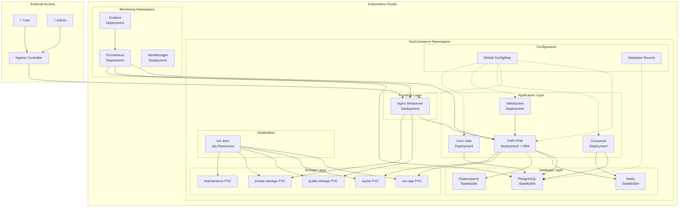
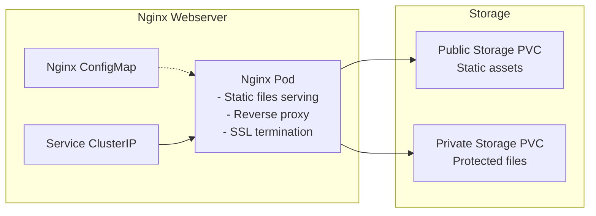
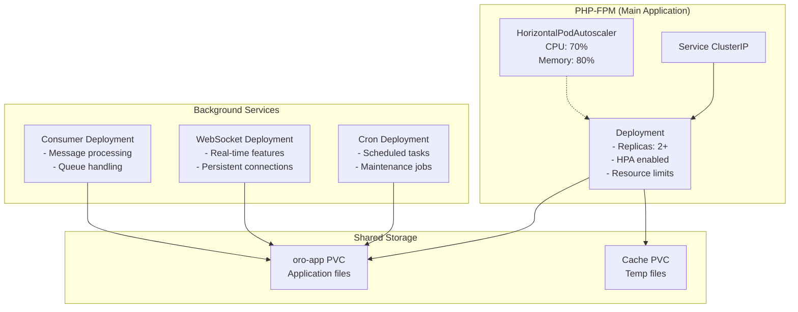
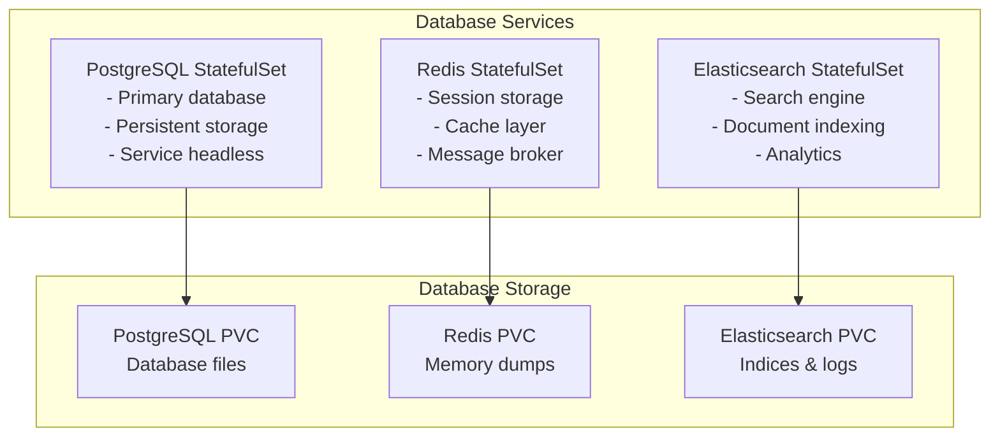
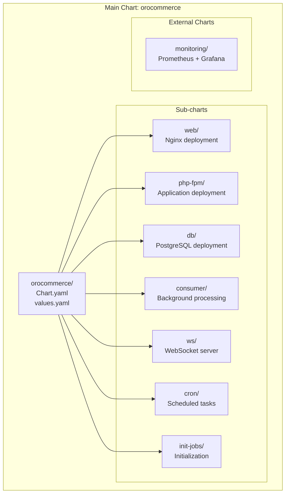
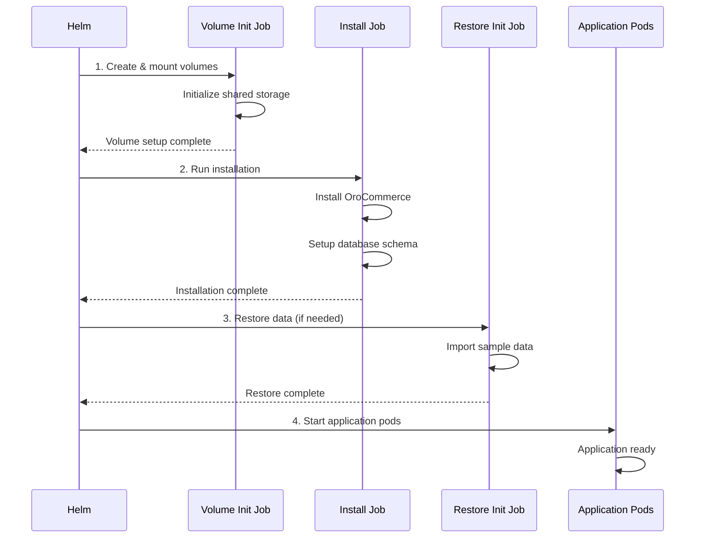
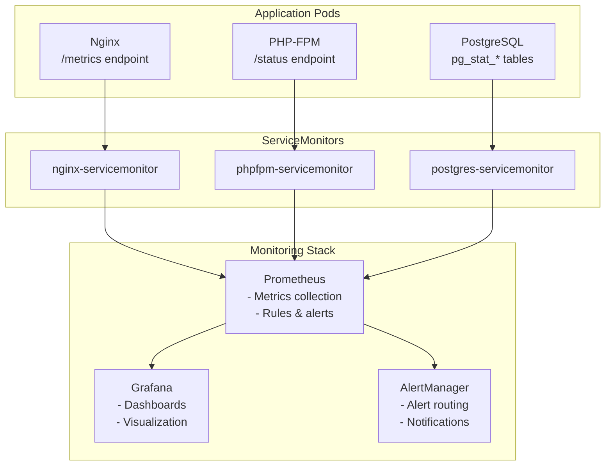
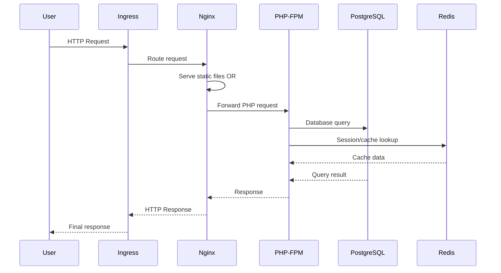
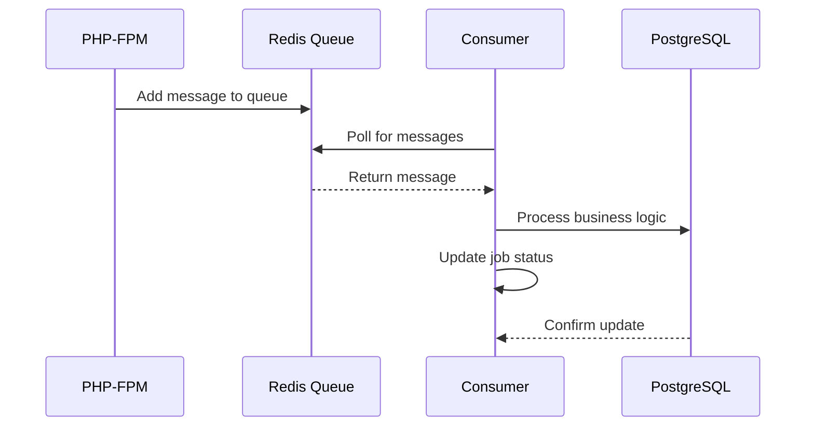
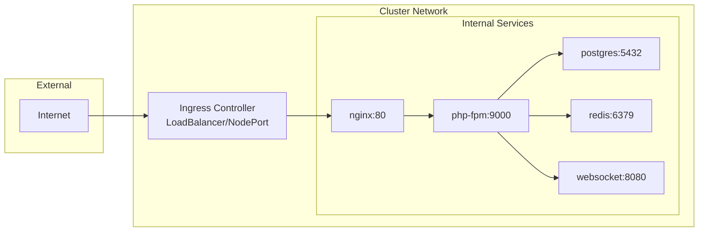

# 🏗️ Architecture Kubernetes OroCommerce

## 🎯 Vue d'ensemble

Cette documentation présente l'architecture complète de la migration d'OroCommerce depuis Docker Compose vers Kubernetes. L'architecture est conçue pour être scalable, résiliente et facile à maintenir grâce à l'utilisation de Helm Charts.

## 📊 Architecture Globale



## 🎛️ Architecture Détaillée des Services

### Frontend Layer



### Application Layer



### Database Layer



## 🔧 Helm Charts Structure



## 📦 Composants Kubernetes

### Deployments & StatefulSets

| Composant | Type | Replicas | Auto-scaling | Description |
|-----------|------|----------|--------------|-------------|
| **webserver** | Deployment | 1-3 | ❌ | Nginx frontend avec load balancing |
| **php-fpm** | Deployment | 2-10 | ✅ HPA | Application principale OroCommerce |
| **consumer** | Deployment | 1-3 | ❌ | Traitement des messages en arrière-plan |
| **websocket** | Deployment | 1-2 | ❌ | Serveur WebSocket pour temps réel |
| **cron** | Deployment | 1 | ❌ | Tâches planifiées et maintenance |
| **database** | StatefulSet | 1 | ❌ | PostgreSQL avec stockage persistant |
| **redis** | StatefulSet | 1 | ❌ | Cache et stockage de sessions |
| **elasticsearch** | StatefulSet | 1 | ❌ | Moteur de recherche |

### Services

| Service | Type | Port | Target | Description |
|---------|------|------|--------|-------------|
| **webserver-svc** | ClusterIP | 80 | nginx:80 | Frontend HTTP |
| **php-fpm-svc** | ClusterIP | 9000 | php-fpm:9000 | Application FastCGI |
| **database-svc** | ClusterIP | 5432 | postgres:5432 | Base de données |
| **redis-svc** | ClusterIP | 6379 | redis:6379 | Cache Redis |
| **websocket-svc** | ClusterIP | 8080 | websocket:8080 | WebSocket server |

### Persistent Volume Claims

| PVC | Taille | Mode d'accès | Utilisé par | Description |
|-----|--------|--------------|-------------|-------------|
| **oro-app** | 10Gi | ReadWriteMany | php-fpm, consumer, cron, websocket | Code application OroCommerce |
| **cache** | 5Gi | ReadWriteMany | php-fpm | Cache temporaire |
| **public-storage** | 20Gi | ReadWriteMany | webserver | Assets publics (images, CSS, JS) |
| **private-storage** | 10Gi | ReadWriteMany | webserver | Fichiers protégés |
| **maintenance** | 1Gi | ReadWriteOnce | init-jobs | Scripts de maintenance |

## 🔐 Configuration et Secrets

### ConfigMap Global

Toutes les variables d'environnement partagées :
- **Variables d'image** : `ORO_IMAGE_TAG`, `ORO_IMAGE`
- **Variables d'application** : `ORO_APP_URL`, `ORO_ENV`
- **Variables de base de données** : `ORO_DB_HOST`, `ORO_DB_PORT`
- **Variables de services** : `ORO_MQ_DSN`, `ORO_SESSION_DSN`
- **Variables WebSocket** : `ORO_WEBSOCKET_BACKEND_HOST`

### Secrets

- **Database credentials** : Mots de passe PostgreSQL
- **Application secrets** : Clés d'encryption OroCommerce
- **TLS certificates** : Certificats SSL pour Ingress

## 🚀 Jobs d'Initialisation

### Séquence d'initialisation



## 📊 Monitoring et Observabilité

### Architecture de Monitoring



## 🔄 Flux de Données

### Requête utilisateur standard



### Traitement asynchrone



## 🏷️ Labels et Sélecteurs

### Stratégie de labelling

Tous les objets Kubernetes utilisent un système de labels cohérent :

```yaml
metadata:
  labels:
    app.kubernetes.io/name: orocommerce
    app.kubernetes.io/instance: release-name
    app.kubernetes.io/component: webserver|php-fpm|database|consumer|websocket|cron
    app.kubernetes.io/part-of: orocommerce
    app.kubernetes.io/managed-by: Helm
    app.kubernetes.io/version: "6.1.0"
```

## 🔧 Ressources et Limites

### Configuration des ressources par composant

| Composant | CPU Request | CPU Limit | Memory Request | Memory Limit |
|-----------|-------------|-----------|----------------|--------------|
| **nginx** | 100m | 500m | 128Mi | 256Mi |
| **php-fpm** | 500m | 1000m | 512Mi | 1Gi |
| **consumer** | 200m | 800m | 256Mi | 512Mi |
| **websocket** | 100m | 300m | 128Mi | 256Mi |
| **cron** | 100m | 200m | 128Mi | 256Mi |
| **postgresql** | 500m | 1000m | 1Gi | 2Gi |
| **redis** | 100m | 200m | 256Mi | 512Mi |

## 🌐 Networking

### Communication entre services



## 🔒 Sécurité

### Network Policies (Optionnel)

```yaml
# Exemple de politique réseau pour isoler la base de données
apiVersion: networking.k8s.io/v1
kind: NetworkPolicy
metadata:
  name: postgres-network-policy
spec:
  podSelector:
    matchLabels:
      app.kubernetes.io/component: database
  policyTypes:
  - Ingress
  ingress:
  - from:
    - podSelector:
        matchLabels:
          app.kubernetes.io/part-of: orocommerce
    ports:
    - protocol: TCP
      port: 5432
```

### Security Context

Tous les pods sont configurés avec des contextes de sécurité appropriés :
- **Non-root user** pour les applications
- **Root access** uniquement pour l'initialisation des volumes
- **readOnlyRootFilesystem** quand possible

## 📈 Scalabilité

### Horizontal Pod Autoscaler (HPA)

Le composant PHP-FPM est configuré avec HPA :

```yaml
apiVersion: autoscaling/v2
kind: HorizontalPodAutoscaler
spec:
  minReplicas: 2
  maxReplicas: 10
  metrics:
  - type: Resource
    resource:
      name: cpu
      target:
        type: Utilization
        averageUtilization: 70
  - type: Resource
    resource:
      name: memory
      target:
        type: Utilization
        averageUtilization: 80
```

## 🎯 Résilience

### Stratégies de déploiement

- **Rolling Update** : Mise à jour sans interruption
- **Readiness/Liveness Probes** : Vérification de santé des pods
- **PodDisruptionBudgets** : Protection contre les interruptions
- **Multi-AZ deployment** : Répartition sur plusieurs zones

---

Cette architecture Kubernetes moderne offre :
- ✅ **Scalabilité** automatique avec HPA
- ✅ **Résilience** avec redondance et health checks
- ✅ **Observabilité** complète avec monitoring
- ✅ **Sécurité** avec isolation et secrets
- ✅ **Maintenance** simplifiée avec Helm Charts
