# 🏗️ Architecture Kubernetes OroCommerce

## 🎯 Vue d'ensemble

Cette documentation présente l'architecture complète de la migration d'OroCommerce depuis Docker Compose vers Kubernetes. L'architecture est conçue pour être scalable, résiliente et facile à maintenir grâce à l'utilisation de Helm Charts.

## 📊 Architecture Globale

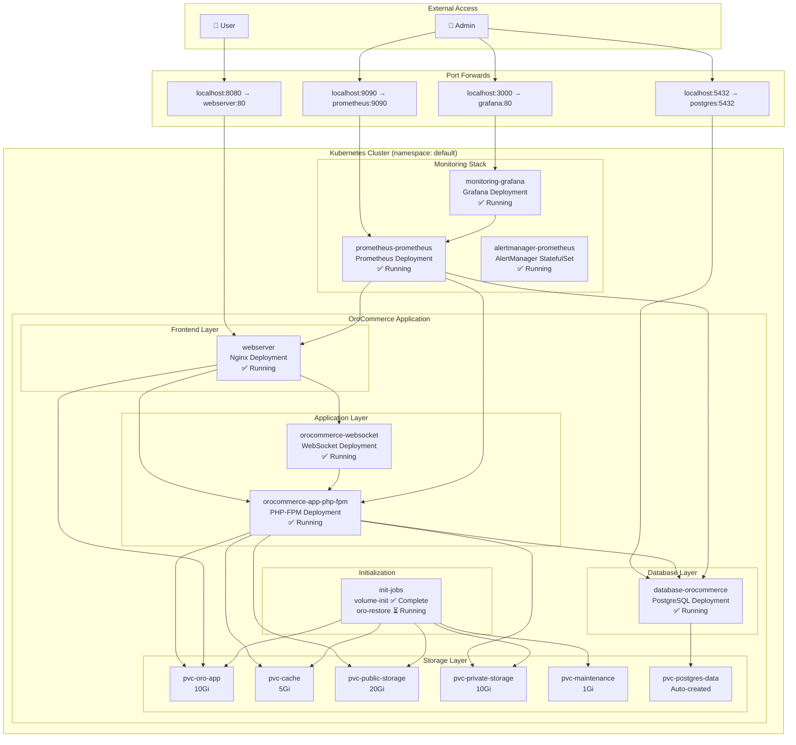

## 🎛️ Architecture Détaillée des Services

### Frontend Layer

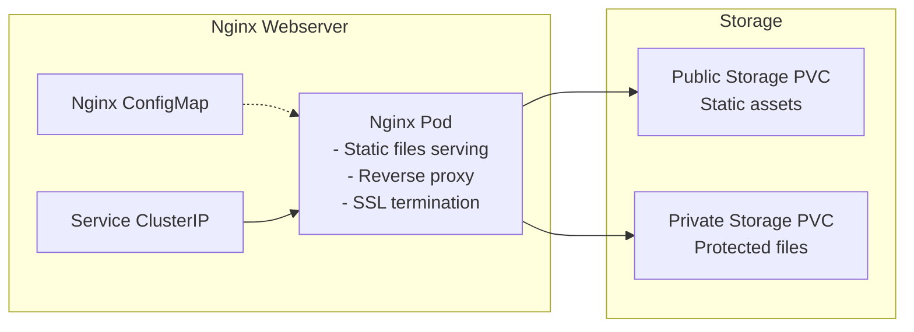

### Application Layer

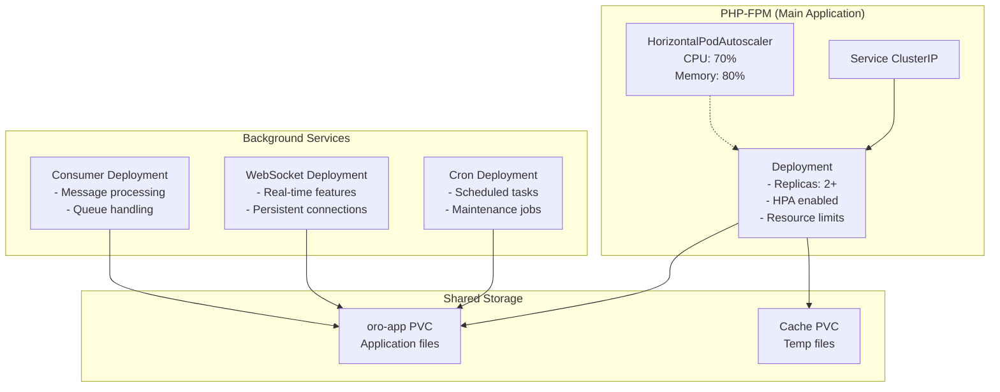

### Database Layer

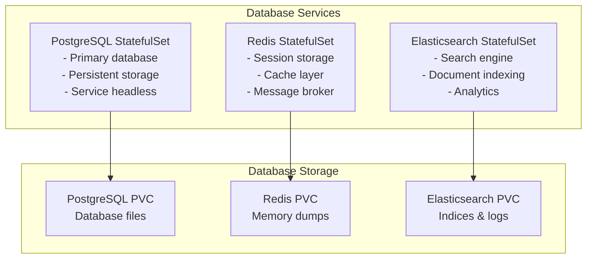

## 🔧 Helm Charts Structure - Déploiement Individuel

**Approche utilisée** : Installation directe des charts individuels (pas d'umbrella chart)

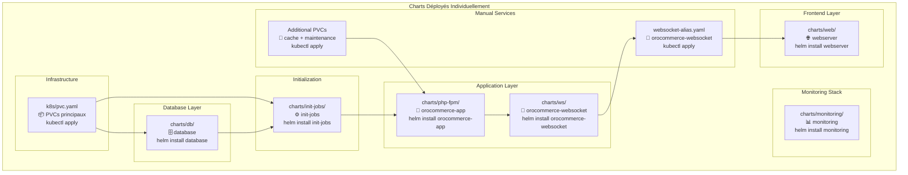

### 📋 Ordre d'installation recommandé

| Étape | Commande | Description | Dépendances |
|-------|----------|-------------|-------------|
| **1** | `kubectl apply -f k8s/pvc.yaml` | PVCs principaux | - |
| **2** | `kubectl apply -f manual-pvcs.yaml` | PVCs additionnels | - |
| **3** | `helm install database charts/db` | Base PostgreSQL | PVCs |
| **4** | `helm install init-jobs charts/init-jobs` | Jobs d'initialisation | Database |
| **5** | `helm install orocommerce-app charts/php-fpm` | Application PHP-FPM | Init jobs |
| **6** | `helm install orocommerce-websocket charts/ws` | Serveur WebSocket | Application |
| **7** | `kubectl apply -f websocket-alias.yaml` | Alias pour webserver | WebSocket |
| **8** | `helm install webserver charts/web` | Frontend Nginx | WebSocket alias |
| **9** | `helm install monitoring charts/monitoring` | Prometheus + Grafana | - |

## 📦 Composants Kubernetes

### Deployments & StatefulSets - État Réel

| Composant | Type | Replicas | Auto-scaling | Release Helm | Description |
|-----------|------|----------|--------------|--------------|-------------|
| **webserver** | Deployment | 1 | ❌ | `webserver` | Nginx frontend ✅ Running |
| **orocommerce-app** | Deployment | 2 | ❌ | `orocommerce-app` | Application PHP-FPM ✅ Running |
| **orocommerce-websocket** | Deployment | 1 | ❌ | `orocommerce-websocket` | Serveur WebSocket ✅ Running |
| **database-orocommerce** | Deployment | 1 | ❌ | `database` | PostgreSQL ✅ Running |
| **init-jobs** | Deployment | 1 | ❌ | `init-jobs` | Jobs d'initialisation ⚠️ Failed |
| **monitoring-grafana** | Deployment | 1 | ❌ | `monitoring` | Grafana dashboard ✅ Running |
| **prometheus-prometheus** | StatefulSet | 1 | ❌ | `monitoring` | Prometheus metrics ✅ Running |
| **alertmanager-prometheus** | StatefulSet | 1 | ❌ | `monitoring` | AlertManager ✅ Running |

### Services - Noms Réels

| Service | Type | Port | Target | Helm Release | Description |
|---------|------|------|--------|--------------|-------------|
| **webserver** | ClusterIP | 80 | nginx:80 | `webserver` | Frontend HTTP |
| **orocommerce-app-php-fpm** | ClusterIP | 9000 | php-fpm:9000 | `orocommerce-app` | Application FastCGI |
| **orocommerce-websocket** | ClusterIP | 80 | websocket:80 | Manuel | Alias pour webserver |
| **orocommerce-websocket-ws** | ClusterIP | 80 | websocket:80 | `orocommerce-websocket` | WebSocket réel |
| **database-orocommerce** | ClusterIP | 5432 | postgres:5432 | `database` | Base de données |
| **monitoring-grafana** | ClusterIP | 80 | grafana:3000 | `monitoring` | Grafana interface |
| **prometheus-prometheus** | ClusterIP | 9090 | prometheus:9090 | `monitoring` | Prometheus API |

### Persistent Volume Claims - Configuration Réelle

| PVC | Taille | Mode d'accès | Créé par | Utilisé par | Description |
|-----|--------|--------------|----------|-------------|-------------|
| **pvc-oro-app** | 10Gi | RWO | `k8s/pvc.yaml` | php-fpm, nginx | Code application OroCommerce |
| **pvc-cache** | 5Gi | RWO | Manuel | php-fpm | Cache temporaire |
| **pvc-public-storage** | 20Gi | RWO | `k8s/pvc.yaml` | nginx | Assets publics (images, CSS, JS) |
| **pvc-private-storage** | 10Gi | RWO | `k8s/pvc.yaml` | nginx | Fichiers protégés |
| **pvc-maintenance** | 1Gi | RWO | Manuel | init-jobs | Scripts de maintenance |
| **postgresql-data-database-orocommerce** | 8Gi | RWO | Auto (database chart) | postgres | Données PostgreSQL |

## 🔐 Configuration et Secrets

### ConfigMap Global

Toutes les variables d'environnement partagées :
- **Variables d'image** : `ORO_IMAGE_TAG`, `ORO_IMAGE`
- **Variables d'application** : `ORO_APP_URL`, `ORO_ENV`
- **Variables de base de données** : `ORO_DB_HOST`, `ORO_DB_PORT`
- **Variables de services** : `ORO_MQ_DSN`, `ORO_SESSION_DSN`
- **Variables WebSocket** : `ORO_WEBSOCKET_BACKEND_HOST`

### Secrets

- **Database credentials** : Mots de passe PostgreSQL
- **Application secrets** : Clés d'encryption OroCommerce
- **TLS certificates** : Certificats SSL pour Ingress

## 🚀 Jobs d'Initialisation

### Séquence d'initialisation

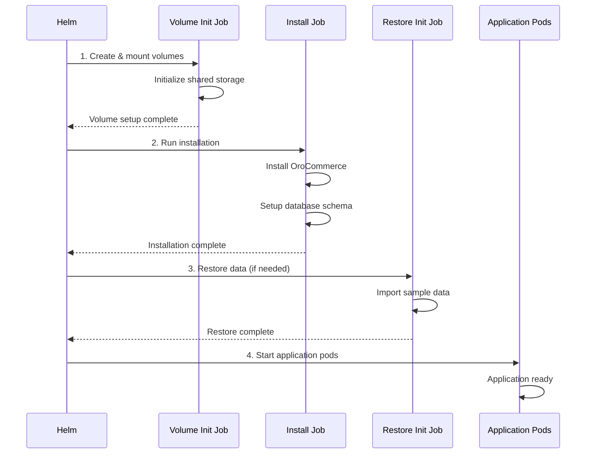

## 📊 Monitoring et Observabilité

### Architecture de Monitoring

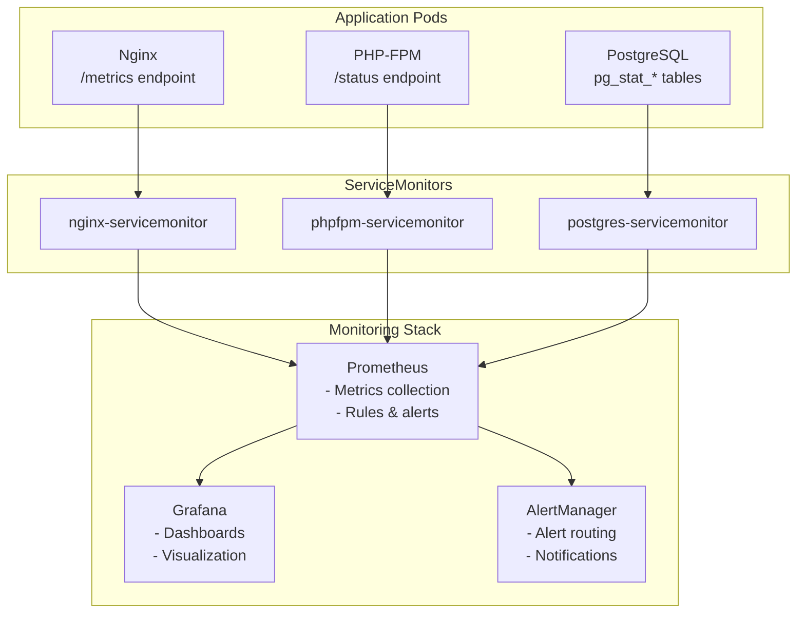

## 🔄 Flux de Données - Architecture Réelle

### Requête utilisateur standard (Port-Forward)

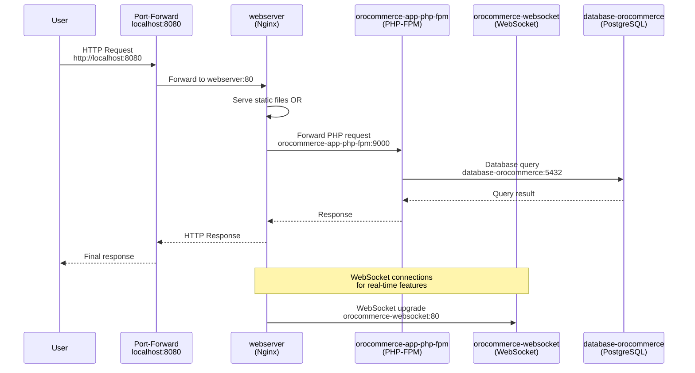

### Accès aux outils de monitoring

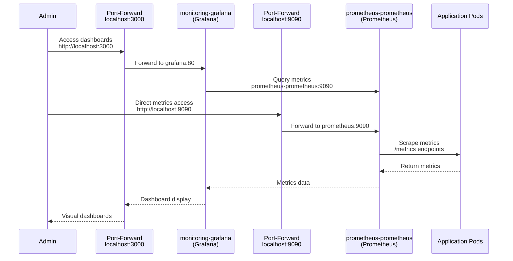

### Jobs d'initialisation

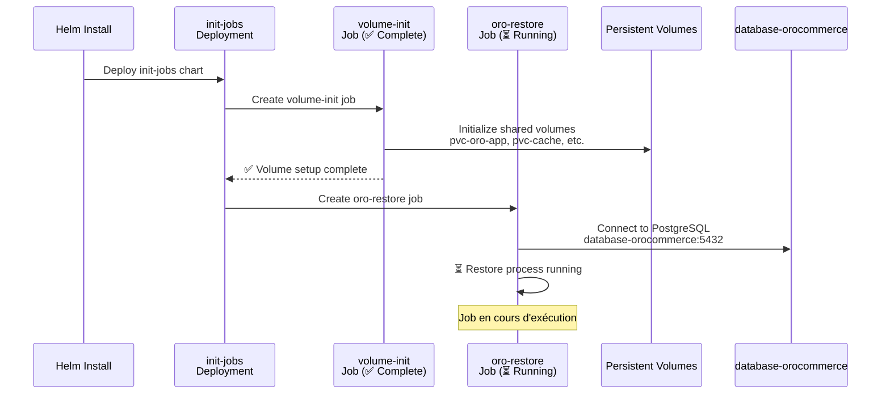

## 🏷️ Labels et Sélecteurs

### Stratégie de labelling

Tous les objets Kubernetes utilisent un système de labels cohérent :

```yaml
metadata:
  labels:
    app.kubernetes.io/name: orocommerce
    app.kubernetes.io/instance: release-name
    app.kubernetes.io/component: webserver|php-fpm|database|consumer|websocket|cron
    app.kubernetes.io/part-of: orocommerce
    app.kubernetes.io/managed-by: Helm
    app.kubernetes.io/version: "6.1.0"
```

## 🔧 Ressources et Limites

### Configuration des ressources par composant

| Composant | CPU Request | CPU Limit | Memory Request | Memory Limit |
|-----------|-------------|-----------|----------------|--------------|
| **nginx** | 100m | 500m | 128Mi | 256Mi |
| **php-fpm** | 500m | 1000m | 512Mi | 1Gi |
| **consumer** | 200m | 800m | 256Mi | 512Mi |
| **websocket** | 100m | 300m | 128Mi | 256Mi |
| **cron** | 100m | 200m | 128Mi | 256Mi |
| **postgresql** | 500m | 1000m | 1Gi | 2Gi |
| **redis** | 100m | 200m | 256Mi | 512Mi |

## 🌐 Networking

### Communication entre services

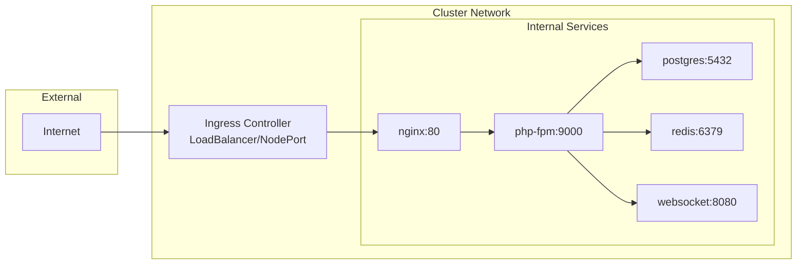

## 🔒 Sécurité

### Network Policies (Optionnel)

```yaml
# Exemple de politique réseau pour isoler la base de données
apiVersion: networking.k8s.io/v1
kind: NetworkPolicy
metadata:
  name: postgres-network-policy
spec:
  podSelector:
    matchLabels:
      app.kubernetes.io/component: database
  policyTypes:
  - Ingress
  ingress:
  - from:
    - podSelector:
        matchLabels:
          app.kubernetes.io/part-of: orocommerce
    ports:
    - protocol: TCP
      port: 5432
```

### Security Context

Tous les pods sont configurés avec des contextes de sécurité appropriés :
- **Non-root user** pour les applications
- **Root access** uniquement pour l'initialisation des volumes
- **readOnlyRootFilesystem** quand possible

## 📈 Scalabilité

### Horizontal Pod Autoscaler (HPA)

Le composant PHP-FPM est configuré avec HPA :

```yaml
apiVersion: autoscaling/v2
kind: HorizontalPodAutoscaler
spec:
  minReplicas: 2
  maxReplicas: 10
  metrics:
  - type: Resource
    resource:
      name: cpu
      target:
        type: Utilization
        averageUtilization: 70
  - type: Resource
    resource:
      name: memory
      target:
        type: Utilization
        averageUtilization: 80
```

## 🎯 Résilience

### Stratégies de déploiement

- **Rolling Update** : Mise à jour sans interruption
- **Readiness/Liveness Probes** : Vérification de santé des pods
- **PodDisruptionBudgets** : Protection contre les interruptions
- **Multi-AZ deployment** : Répartition sur plusieurs zones

## 🎯 État du Déploiement

### ✅ Services Opérationnels

| Service | URL d'accès | Status | Remarques |
|---------|-------------|--------|-----------|
| **OroCommerce App** | http://localhost:8080 | ✅ Running | Application principale accessible |
| **Grafana Monitoring** | http://localhost:3000 | ✅ Running | admin/admin - 6+ heures de métriques disponibles |
| **Prometheus Metrics** | http://localhost:9090 | ✅ Running | Collecte active des métriques |
| **PostgreSQL Database** | localhost:5432 | ✅ Running | oro/oro - Base fonctionnelle |
