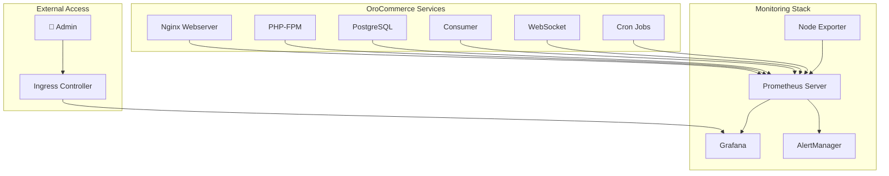

# 📊 Guide de Monitoring OroCommerce

## 🎯 Vue d'ensemble

Ce guide explique comment utiliser la stack de monitoring Prometheus/Grafana pour surveiller votre application OroCommerce déployée sur Kubernetes.

## 🏗️ Architecture de Monitoring



## 📈 Métriques collectées

### 🌐 Nginx (Webserver)
- **Trafic HTTP** : Requêtes/s, codes de statut
- **Performance** : Temps de réponse, latence
- **Erreurs** : Taux d'erreur 4xx/5xx

### 🐘 PHP-FPM (Backend)
- **Processus** : Actifs, inactifs, total
- **Performance** : File d'attente, connexions/s
- **Ressources** : Mémoire par processus

### 🗄️ PostgreSQL (Database)
- **Connexions** : Actives, maximum, utilisation
- **Requêtes** : SELECT/INSERT/UPDATE/DELETE par seconde
- **Stockage** : Taille des bases de données

### ⚙️ Infrastructure Kubernetes
- **Pods** : CPU, mémoire, redémarrages
- **Volumes** : Utilisation disque
- **Services** : Disponibilité

## 🚀 Installation et Configuration

### 1. Prérequis

```bash
# Vérifier Kubernetes
kubectl version --client
kubectl cluster-info

# Vérifier Helm
helm version
```

### 2. Installation complète

```bash
# Cloner le projet
git clone <votre-repo>
cd orocommerce-k8s

# Installer avec monitoring
helm install orocommerce charts/orocommerce \
  --namespace orocommerce \
  --create-namespace \
  --set monitoring.enabled=true
```

### 3. Vérification du déploiement

```bash
# Vérifier les pods
kubectl get pods -n orocommerce

# Vérifier les services
kubectl get svc -n orocommerce

# Vérifier les ServiceMonitors
kubectl get servicemonitor -n orocommerce
```

## 🎛️ Accès aux interfaces

### 📊 Grafana Dashboard

#### Option 1 : Port Forward (Développement)
```bash
kubectl port-forward service/monitoring-grafana 3000:80 -n default
```
🌐 Accès : http://localhost:3000  
👤 Username : `admin`  
🔑 Password : `admin123`

#### 📊 Localiser les Dashboards OroCommerce

Une fois connecté à Grafana :

1. **Menu gauche** → **Dashboards** → **Browse**
2. Cherchez **"OroCommerce"** dans la barre de recherche
3. Vous devriez voir 3 dashboards spécifiques :
   - 🎯 **OroCommerce - Vue d'ensemble**
   - 🐘 **OroCommerce - PHP-FPM Détaillé**
   - 🗄️ **OroCommerce - Base de Données**

**⚠️ Si vous ne voyez que les dashboards Kubernetes :**
- Attendez 2-3 minutes après le démarrage de Prometheus
- Rafraîchissez la page (F5)
- Vérifiez que Prometheus fonctionne : Status → Configuration → Service Discovery

#### Option 2 : Ingress (Production)
```yaml
# Dans values.yaml
grafana:
  ingress:
    enabled: true
    hosts:
      - grafana.votre-domaine.com
```

### 🔍 Prometheus UI

```bash
kubectl port-forward service/prometheus-server 9090:80 -n orocommerce
```
🌐 Accès : http://localhost:9090

### 🚨 AlertManager

```bash
kubectl port-forward service/prometheus-alertmanager 9093:80 -n orocommerce
```
🌐 Accès : http://localhost:9093

## 📊 Utilisation des Dashboards

### 1. OroCommerce - Vue d'ensemble
**Utilisation** : Monitoring général de l'application
- **Métriques clés** : Requêtes/s, temps de réponse, processus PHP
- **Rafraîchissement** : 5 secondes
- **Timerange** : Dernière heure

**Interprétation** :
- 🟢 Trafic stable : 10-100 req/s
- 🟡 Temps réponse : < 1s normal, > 2s problématique
- 🔴 Processus PHP : > 80% = surcharge

### 2. OroCommerce - PHP-FPM Détaillé
**Utilisation** : Performance du backend PHP
- **Pool monitoring** : Processus actifs/inactifs
- **Queue management** : File d'attente
- **Memory tracking** : Consommation mémoire

**Actions recommandées** :
- Si queue > 10 : Augmenter `pm.max_children`
- Si processus actifs > 80% : Scale horizontal
- Si mémoire > 500MB/processus : Optimiser code

### 3. OroCommerce - Base de Données
**Utilisation** : Performance PostgreSQL
- **Connexions** : Surveillance des limites
- **Requêtes** : Types et fréquence
- **Stockage** : Croissance des données

**Seuils d'alerte** :
- Connexions > 80% du max
- Requêtes lentes > 5/s
- Croissance DB > 1GB/jour

## 🚨 Gestion des Alertes

### Alertes critiques configurées

| Alerte | Seuil | Action |
|--------|--------|--------|
| High Response Time | > 2s pendant 5min | Vérifier PHP-FPM/DB |
| High Error Rate | > 5% erreurs 5xx | Analyser logs application |
| PHP-FPM High Load | > 80% processus | Scale horizontal |
| Database Down | 1min indisponible | Redémarrer service DB |
| Pod Crash Loop | Redémarrages fréquents | Vérifier ressources |

### Configuration des notifications

```yaml
# Dans values.yaml - AlertManager
alertmanager:
  config:
    global:
      smtp_smarthost: 'smtp.company.com:587'
    route:
      group_by: ['alertname']
      receiver: 'web.hook'
    receivers:
    - name: 'web.hook'
      email_configs:
      - to: admin@company.com
        subject: '🚨 Alerte OroCommerce'
```

## 🔧 Dépannage

### Problèmes courants

#### 1. Métriques non collectées
```bash
# Vérifier ServiceMonitors
kubectl get servicemonitor -n orocommerce

# Vérifier targets Prometheus
kubectl port-forward service/prometheus-server 9090:80 -n orocommerce
# Aller sur Status > Targets
```

#### 2. Grafana ne se connecte pas
```bash
# Vérifier le pod Grafana
kubectl logs -l app.kubernetes.io/name=grafana -n orocommerce

# Redémarrer Grafana
kubectl rollout restart deployment/prometheus-grafana -n orocommerce
```

#### 3. Dashboards vides
```bash
# Vérifier la datasource Prometheus
# Dans Grafana : Configuration > Data Sources > Prometheus
# URL doit être : http://prometheus-server:80
```

### Commandes de diagnostic

```bash
# Status général
kubectl get all -n orocommerce | grep prometheus
kubectl get all -n orocommerce | grep grafana

# Logs détaillés
kubectl logs -l app.kubernetes.io/name=prometheus -n orocommerce --tail=100
kubectl logs -l app.kubernetes.io/name=grafana -n orocommerce --tail=100

# Configuration
kubectl describe servicemonitor -n orocommerce
kubectl describe prometheusrules -n orocommerce
```

## 📝 Personnalisation

### Ajouter une métrique custom

1. **Exposer la métrique dans votre service**
```php
// Dans PHP, utiliser prometheus/client_php
$registry = CollectorRegistry::getDefault();
$counter = $registry->registerCounter('app', 'orders_total', 'Total orders');
$counter->inc();
```

2. **Créer le ServiceMonitor**
```yaml
apiVersion: monitoring.coreos.com/v1
kind: ServiceMonitor
metadata:
  name: custom-metrics
spec:
  selector:
    matchLabels:
      app: your-service
  endpoints:
  - port: metrics
    path: /metrics
```

3. **Ajouter au dashboard Grafana**
```json
{
  "targets": [
    {
      "expr": "rate(app_orders_total[5m])",
      "legendFormat": "Orders/s"
    }
  ]
}
```

### Modifier les seuils d'alerte

```yaml
# Dans prometheus-rules.yaml
- alert: CustomAlert
  expr: your_metric > threshold
  for: duration
  labels:
    severity: warning
  annotations:
    summary: "Description de l'alerte"
```

## 🎓 Critères projet

Cette solution répond aux exigences :

### ✅ Critère 1 : Surveiller l'activité
- **Flux temps réel** : Dashboards refresh 5-30s
- **Outils monitoring** : Prometheus/Grafana industriels
- **Administration données** : Rétention 30j, archivage

### ✅ Critère 2 : Optimiser l'exploitation
- **Visualisation adaptée** : 3 dashboards spécialisés
- **Écoconception** : Alertes ressources, optimisation
- **Répartition charge** : Monitoring HPA, load balancing

## 📚 Ressources supplémentaires

- [Documentation Prometheus](https://prometheus.io/docs/)
- [Documentation Grafana](https://grafana.com/docs/)
- [PromQL Guide](https://prometheus.io/docs/prometheus/latest/querying/)
- [Kubernetes Monitoring](https://kubernetes.io/docs/tasks/debug-application-cluster/resource-usage-monitoring/)

---

🎯 **Votre monitoring est maintenant opérationnel !** Cette solution vous permet de surveiller efficacement votre application OroCommerce et répond aux critères d'évaluation de votre projet.